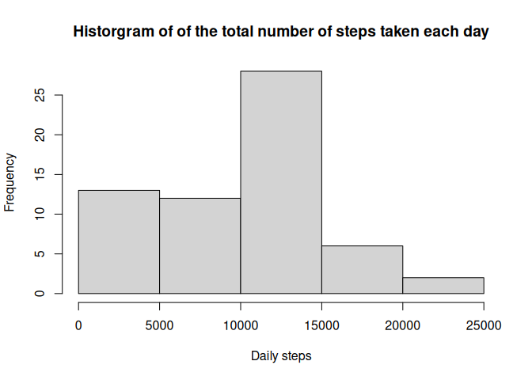
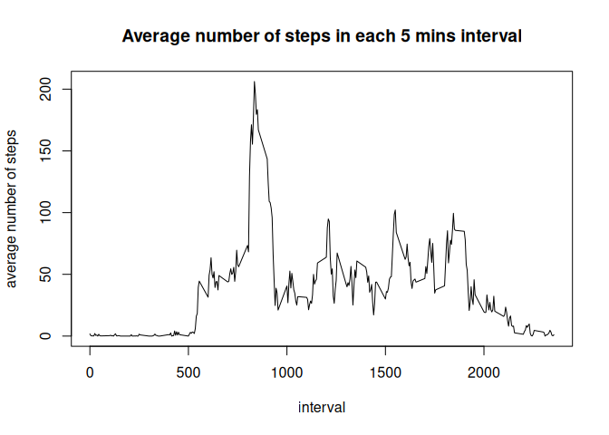
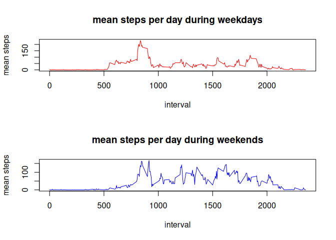

## Loading and preprocessing the data


```r
library(dplyr)
```

```
## 
## Attaching package: 'dplyr'
```

```
## The following objects are masked from 'package:stats':
## 
##     filter, lag
```

```
## The following objects are masked from 'package:base':
## 
##     intersect, setdiff, setequal, union
```

```r
# Download the dataset
url <- "https://d396qusza40orc.cloudfront.net/repdata%2Fdata%2Factivity.zip"
f <- file.path(getwd(), "data.zip")
download.file(url, destfile=f)
unzip("data.zip")

# Read the dataset
activity <- read.table("activity.csv", sep = ",", header = TRUE)

# convert date column to date format
activity$date <- as.Date(activity$date, format = "%Y-%m-%d")
```


## What is mean total number of steps taken per day?

```r
# 1. Calculate the mean and median of total number of steps taken daily

daily_steps <- activity %>% 
                    group_by(date) %>% 
                    summarise(mean_steps = sum(steps, na.rm = TRUE))


mean_daily_steps <- mean(daily_steps$mean_steps)
median_daily_steps <- median(daily_steps$mean_steps)

# Create a histogram of the total number of steps taken each day

hist(daily_steps$mean_steps, main = "Historgram of of the total number of steps taken each day", xlab = "Daily steps")
```

<!-- -->

Mean and median of the total number of steps taken per day is `mean_daily_steps` and `median_daily_steps` respectively.


## What is the average daily activity pattern?

```r
# 1. Create a time series plot of average number of steps in each 5 mins interval

mean_steps_mins <- activity %>% 
                      group_by(interval) %>% 
                      summarise(mean_steps = mean(steps, na.rm = TRUE))


with(mean_steps_mins, plot(interval, mean_steps, type = "l", main = "Average number of steps in each 5 mins interval", ylab = "average number of steps"))
```

<!-- -->

```r
# 2. Find out which 5-minute interval contains the maximum number of steps on average across all the days in the dataset.

max_steps_interval <- mean_steps_mins$interval[which(mean_steps_mins$mean_steps == max(mean_steps_mins$mean_steps))]
```

5-minute interval with id `max_steps_interval` contains the maximum number of steps on average across all the days in the dataset.


## Imputing missing values

```r
# 1. Calculate and report the total number of missing values in the dataset (i.e. the total number of rows with NAs)

# As the column steps contain NA values, we will only look specifically at this column for # of rows with NAs
sum(is.na(activity$steps))
```

```
## [1] 2304
```

```r
# 2. Devise a strategy for filling in all of the missing values in the dataset. The strategy does not need to be sophisticated. For example, you could use the mean/median for that day, or the mean for that 5-minute interval, etc.

# Step 1 could be to use the mean of that 5-minute interval to fill in for the missing value. If there are any missing values still remaining then the mean of the day can be used to fill in for the missing value.


# 3. Create a new dataset that is equal to the original dataset but with the missing data filled in.
activity_updated <- activity

for (i in 1:nrow(activity_updated)) {
  if(is.na(activity_updated$steps[i])) {
    activity_updated$steps[i] = mean_steps_mins$mean_steps[mean_steps_mins$interval == activity_updated$interval[i]]
    }
}


# 4. Make a histogram of the total number of steps taken each day and Calculate and report the mean and median total number of steps taken per day. Do these values differ from the estimates from the first part of the assignment? What is the impact of imputing missing data on the estimates of the total daily number of steps?

daily_steps_updated <- activity_updated %>% 
                    group_by(date) %>% 
                    summarise(mean_steps = sum(steps, na.rm = TRUE))

mean_daily_steps_updated <- mean(daily_steps_updated$mean_steps)
median_daily_steps_updated <- median(daily_steps_updated$mean_steps)


# Create a histogram of the total number of steps taken each day

# hist(daily_steps_updated$mean_steps, main = "Histogram of of the total number of steps taken each day", xlab = "Daily steps")
# 
# abline(v = mean_daily_steps, col="red")
# abline(v = median_daily_steps, col="blue")


library(ggplot2)

ggplot(data=daily_steps_updated, aes(x=mean_steps)) +
  geom_histogram(binwidth=500, fill="blue", color="black") +
  geom_vline(aes(xintercept=mean_daily_steps), color="red", linetype="dashed") +  geom_vline(aes(xintercept=median_daily_steps), color="blue", linetype="dashed") +
  labs(title="Histogram of of the total number of steps taken each day", x="Steps", y="Frequency") +
  theme_minimal()
```

<!-- -->


## Are there differences in activity patterns between weekdays and weekends?

```r
# 1. Create a new factor variable in the dataset with two levels – “weekday” and “weekend” indicating whether a given date is a weekday or weekend day.

activity_updated$day <- ifelse(weekdays(activity_updated$date) %in% c("Saturday", "Sunday"), "weekend", "weekday")


mean_steps_mins_updated <- activity_updated %>% 
                      group_by(day, interval) %>% 
                      summarise(mean_steps = mean(steps, na.rm = TRUE))
```

```
## `summarise()` has grouped output by 'day'. You can override using the `.groups`
## argument.
```

```r
# 2. Make a panel plot containing a time series plot (i.e. type = "l"type = "l") of the 5-minute interval (x-axis) and the average number of steps taken, averaged across all weekday days or weekend days (y-axis). See the README file in the GitHub repository to see an example of what this plot should look like using simulated data.

par(mfrow=c(2,1))
with(mean_steps_mins_updated, plot(interval, mean_steps, type="n"))
with(mean_steps_mins_updated[mean_steps_mins_updated$day == "weekday",], plot(interval, mean_steps, type="l", col="red"))
```

<!-- -->

```r
with(mean_steps_mins_updated[mean_steps_mins_updated$day == "weekend",], plot(interval, mean_steps, type="l", col="blue"))
```

<!-- -->
